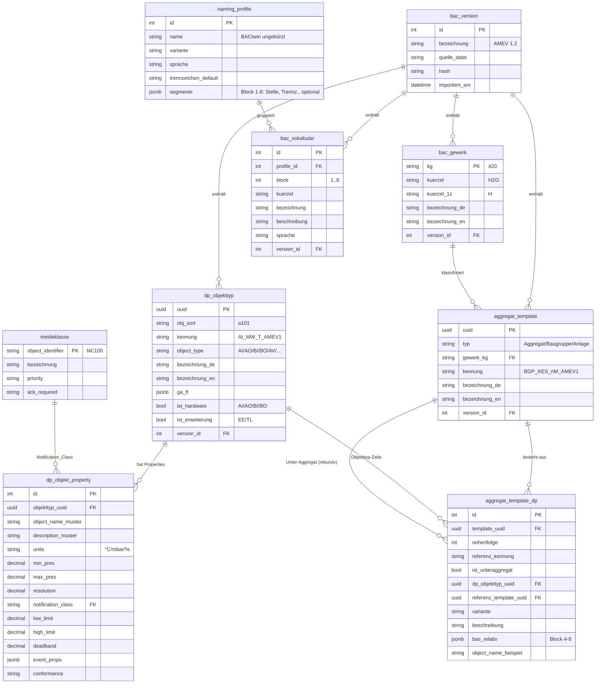
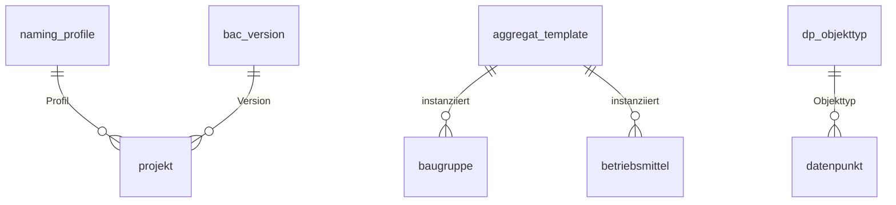

# ER-Modell (konsolidiert)

> Zusammenführung des Datenmodells aus `Konzept.md` §4, den Verfeinerungen aus
> `Beispiel-Gaskessel.md` §5 und der `Import-Pipeline.md`. Zwei Schemata:
> **`catalog`** (importierte, versionierte BACtwin-Stammdaten) und **`project`**
> (projektspezifische Planungsdaten). Diagramme in Mermaid — GitHub rendert sie
> nativ.

## 1. Überblick & Leseweise

- **`catalog`** ist read-only Stammdatenbestand aus dem BACtwin-Import; alles hängt
  an einer `bac_version`.
- **`project`** ist der Arbeitsbereich; Objekte referenzieren `catalog` per UUID,
  materialisieren die Datenpunkte aber lokal (Projektstabilität).
- **Grenze catalog↔project:** nur wenige, klar benannte Referenzen (§4). Ein neuer
  Import verändert bestehende Projekte nie automatisch.

Kardinalitäten: `||` genau eins · `o{` null bis viele · `|{` eins bis viele ·
`o|` null oder eins.

---

## 2. Schema `catalog` (BACtwin-Stammdaten)



**Ergänzende Referenztabellen** (an `bac_version` gehängt, ohne eigene
Beziehungen im Diagramm): `funktionsbereich`, `zustaendigkeit`,
`min_char_length`, `priority_array`, `event_parameter`, `betreibervorgabe`.

Schlüsselstellen aus dem Gaskessel-Beispiel:
- `aggregat_template_dp` ist die **rekursive** Brücke: `template_uuid` = Elter,
  und je Zeile **entweder** `dp_objekttyp_uuid` (Datenpunkt) **oder**
  `referenz_template_uuid` (Unter-Aggregat, Self-Reference auf
  `aggregat_template`). Der Kessel `BGP_KES_nM` referenziert so 5 Unter-Aggregate.
- `bas_relativ` speichert **nur Block 4–8**; Block 1–3 kommt beim Instanziieren
  aus dem Projektkontext.

---

## 3. Schema `project` (Planungsdaten)

```mermaid
erDiagram
    projekt ||--o{ anlage : "enthält"
    anlage  ||--o{ baugruppe : "enthält"
    baugruppe ||--o{ betriebsmittel : "enthält"
    betriebsmittel ||--o{ datenpunkt : "erzeugt"
    baugruppe ||--o{ datenpunkt : "direkt (Sicherheitskette/SV)"
    betriebsmittel ||--o{ kabel : "verdrahtet"
    anlage ||--o{ regelkreis : "enthält"
    regelkreis ||--o{ regelkreis_element : "gruppiert"
    projekt ||--o{ dokument : "generiert"

    projekt {
        int    id PK
        string name
        string kunde
        int    naming_profile_id FK "→catalog"
        int    bac_version_id FK "→catalog"
        string status
        datetime erstellt_am
    }
    anlage {
        int    id PK
        int    projekt_id FK
        string gewerk_kg "420"
        string anlage_kuerzel "VBA"
        int    nummer
        int    teilanlage
        string bas "420_VBA01"
    }
    baugruppe {
        int    id PK
        int    anlage_id FK
        uuid   aggregat_template_uuid FK "→catalog"
        string kuerzel "KES"
        int    nummer
        string medium_pos
        jsonb  position "Canvas x/y"
        string bas
    }
    betriebsmittel {
        int    id PK
        int    baugruppe_id FK
        uuid   aggregat_template_uuid FK "→catalog"
        string kategorie "Regelorgan/Betriebsmittel"
        string kuerzel "T~~ / VEN"
        int    nummer
        string bas
    }
    datenpunkt {
        int     id PK
        string  quelle_typ "baugruppe/betriebsmittel"
        int     quelle_id
        uuid    dp_objekttyp_uuid FK "→catalog"
        string  bas_funktion "MW~01"
        string  bas "voll aufgelöst"
        string  adresse "DDC-Kanal"
        string  units
        decimal min_pres
        decimal max_pres
        string  prio
        bool    trend "aus TL"
        bool    alarm "aus EE/NC"
    }
    regelkreis {
        int    id PK
        int    anlage_id FK
        string art "Konstant/Folge/..."
        string bezeichnung
        string bas
    }
    regelkreis_element {
        int    id PK
        int    regelkreis_id FK
        string element_typ "betriebsmittel/datenpunkt"
        int    element_id
        string rolle "Istwert/Sollwert/Stellglied/Meldung"
    }
    kabel {
        int    id PK
        int    betriebsmittel_id FK
        string von "Feldgerät"
        string nach "Schaltschrank/DDC"
        string kabeltyp
        int    adern
        string querschnitt
        decimal laenge
    }
    dokument {
        int    id PK
        int    projekt_id FK
        string art "DP-Liste/Kabelliste/Schema/Regelbeschr."
        string format "xlsx/docx/svg/dxf"
        string pfad
        string quelle_hash
        datetime erzeugt_am
    }
```

**Polymorphe Quelle von `datenpunkt`:** ein Datenpunkt hängt entweder an einem
`betriebsmittel` **oder** direkt an einer `baugruppe` (z. B. Sicherheitskette,
SV-Container) — abgebildet über `quelle_typ` + `quelle_id`. `regelkreis_element`
ist ebenso polymorph (`element_typ`/`element_id`), damit ein Regelkreis Geräte
**und** einzelne Datenpunkte über Baugruppen hinweg gruppieren kann.

`audit_log` (`entity`, `entity_id`, `aktion`, `benutzer`, `zeit`, `diff jsonb`)
protokolliert projektweit und steht bewusst außerhalb des Diagramms.

---

## 4. Grenze catalog ↔ project (Materialisierung)

Nur diese fünf Referenzen überqueren die Schemagrenze (project → catalog):

| project | Feld | → catalog | Bedeutung |
|---------|------|-----------|-----------|
| `projekt` | `naming_profile_id` | `naming_profile` | gewähltes BAS-Profil |
| `projekt` | `bac_version_id` | `bac_version` | gebundener Bibliotheksstand |
| `baugruppe` | `aggregat_template_uuid` | `aggregat_template` | instanziiertes Template |
| `betriebsmittel` | `aggregat_template_uuid` | `aggregat_template` | instanziiertes (Unter-)Template |
| `datenpunkt` | `dp_objekttyp_uuid` | `dp_objekttyp` | BACnet-Objekttyp (Herkunft der Properties) |



**Materialisierungsregel:** Beim Ziehen einer Baugruppe expandiert der
Instanziierer `aggregat_template` → alle `aggregat_template_dp` (rekursiv) und
schreibt je Zeile einen `datenpunkt` mit voll aufgelöstem `bas`
(`NamingEngine.compose(kontext, bas_relativ)`) und kopierten Properties (units,
min/max, prio) aus `dp_objekt_property`. Danach ist das Projekt **unabhängig** vom
Katalog.

---

## 5. Herleitung der vier Dokumente aus dem Modell

| Dokument | Query-Kern |
|----------|-----------|
| **Datenpunktliste** | `datenpunkt` je `anlage` (join `dp_objekttyp`, `dp_objekt_property`) |
| **Kabelzugliste** | `datenpunkt WHERE dp_objekttyp.ist_hardware`, gruppiert je `betriebsmittel` → `kabel` |
| **Regelschema** | `regelkreis` + `regelkreis_element` (Rollen) + Symbol-Zuordnung |
| **Regelbeschreibung** | `regelkreis.art` → Textbaustein, Platzhalter aus `datenpunkt.bas`/Sollwerten |

---

## 6. Offene Punkte

1. Kabeltyp/Klemmen sind in BACtwin **nicht** enthalten → separate
   `catalog`-Tabelle `kabeltyp` + `klemmen_vorlage` je Objekttyp/Aggregat (aus
   `Konzept.md` §3, hier noch nicht modelliert, da Pflegedaten statt BACtwin).
2. Symbol-/Textbaustein-Bibliothek (Schema + Regelbeschreibung) als eigene
   `catalog`-Tabellen `schema_symbol`, `textbaustein`.
3. `datenpunkt.adresse` (DDC-Kanal/BACnet-Instanz) — Vergabestrategie festlegen
   (automatisch vs. manuell) vor den Migrationen.
